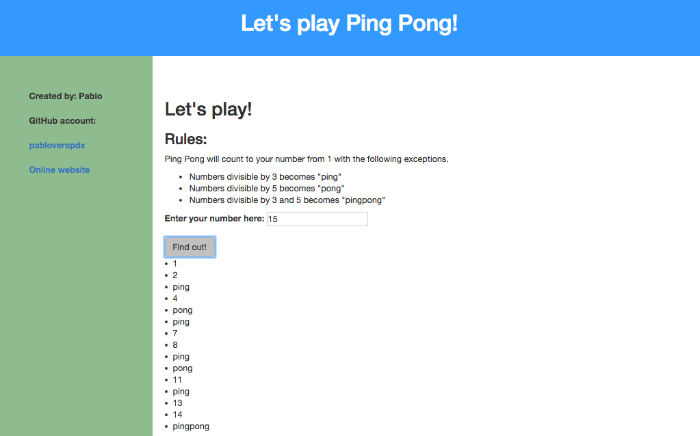

# Ping Pong Test

#### A web application
Create a web application that takes a number from a user and returns a range of numbers from 1 to the chosen number.

### Pablo Vera

## Description
Create a web application that takes a number from a user and returns a range of numbers from 1 to the chosen number with the following exceptions:

- Numbers divisible by 3 are replaced with "ping"
- Numbers divisible by 5 are replaced with "pong"
- Numbers divisible by 15 are replaced with "pingpong"

## setup
The application can be installed by cloning the project

or view it on github pages: http://pabloverapdx.github.io/Intro-codereview-pingpong/

## Technology used:
HTML, CSS, JavaScript, jQuery, Mocha, Chai

###Legal:
Copyright (c) 2016 **Pablo Vera**
